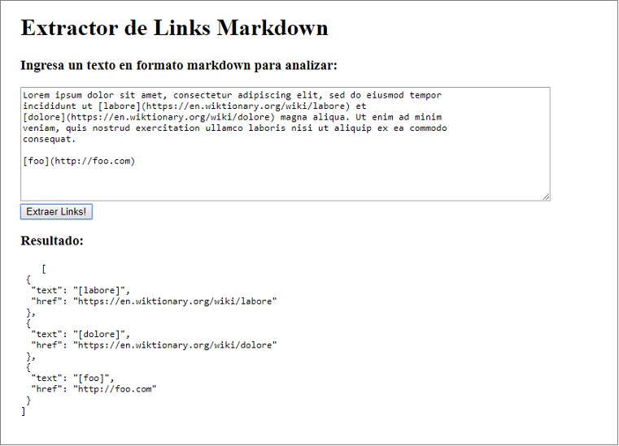

<p align="center">
	
	</img>
</p>
<p align="center">
	a markdown link extractor
</p>
<p align="center">
	<a href="https://badge.fury.io/js/sweetalert"></a>
</p>

## Descripción
**Linkin' Mark** es un extractor de links desde formato Markdown. Puedes instalarlo como módulo en Node.js o implementarlo en tu página web.

## Instalación

    $ npm install --save linkinmark

## Uso
### Node.js
1. Instala **Linkin' Mark** en la carpeta raíz de tu proyecto.
2. Modifica la siguiente línea del código base en `index.js`, incorporando la ruta del archivo markdown a procesar:

	```
	const md = fs.readFileSync('<mi-archivo.md>').toString();
	```

3. En tu consola, posiciónate en la carpeta raíz de tu proyecto y ejecuta `index.js` :

	```
	node index.js
	```

4. El resultado será un objeto JSON, conteniendo cada link del archivo markdown seleccionado.

	````
	[{"text":"labore","href":"https://en.wiktionary.org/wiki/labore"},{"text":"dolore","href":"https://en.wiktionary.org/wiki/dolore"},{"text":"foo","href":"http://foo.com"}
	````

### Browser
La versión para páginas web, requiere sólo de unas cuantas líneas de código. Al efectuar la búsqueda, **Linkin' Mark** devolverá los resultados en un objeto JSON. Para incorporar esta herramienta en tu página, sigue los siguientes pasos:
1. Descarga **Linkin' Mark**.
2. Incorpora la carpeta `lib` conteniendo el archivo `md-link-extractor.js` en  la carpeta raíz de tu proyecto:
3. Crea un elemento `<input>` o `<textarea>` con `id="markdown"` en tu html. Agrega un botón con el atributo `onclick="myLinks()"`.
Por último, para poder visualizar el resultado de la búsqueda, incorpora un elemento `<pre></pre>` y un elemento `<code></code>` con `id="result"` anidado en su interior. Puedes seguir este ejemplo:

	```
	<body>
	  <h1>Extractor de Links Markdown</h1>
	  <h3>Ingresa un texto en formato markdown para analizar:</h3>
	  <textarea id="markdown" cols="100" rows="10"></textarea>
	  <button onclick="myLinks()">Extraer Links!</button>
	  <h3>Resultado:</h3>
	  <pre>
	    <code id="result"></code>
	  </pre>
	</body>
	```
4. Agrega el script al final del `body` de tu archivo `html`:

	```
	<script src=".lib/md-link-extractor.js"></script>
	<script>
    function myLinks() {
      let markdown = document.getElementById('markdown').value;
      document.getElementById('result').innerHTML = markdownLinkExtractor(markdown);
    };
    </script>
	```
5. Si decides modificar los nombres de id sugeridas, recuerda verificar que coincidan con el script.

El resultado se verá así:


## Autoras
[Makarena Fernández](https://github.com/missmakita), [Visaka Devi](https://github.com/visidevi) y [Viviana Marcelo](https://github.com/skyblue16).
Estudiantes de [Laboratoria](https://laboratoria.la).

## Licencia
[MIT](LICENSE.txt)